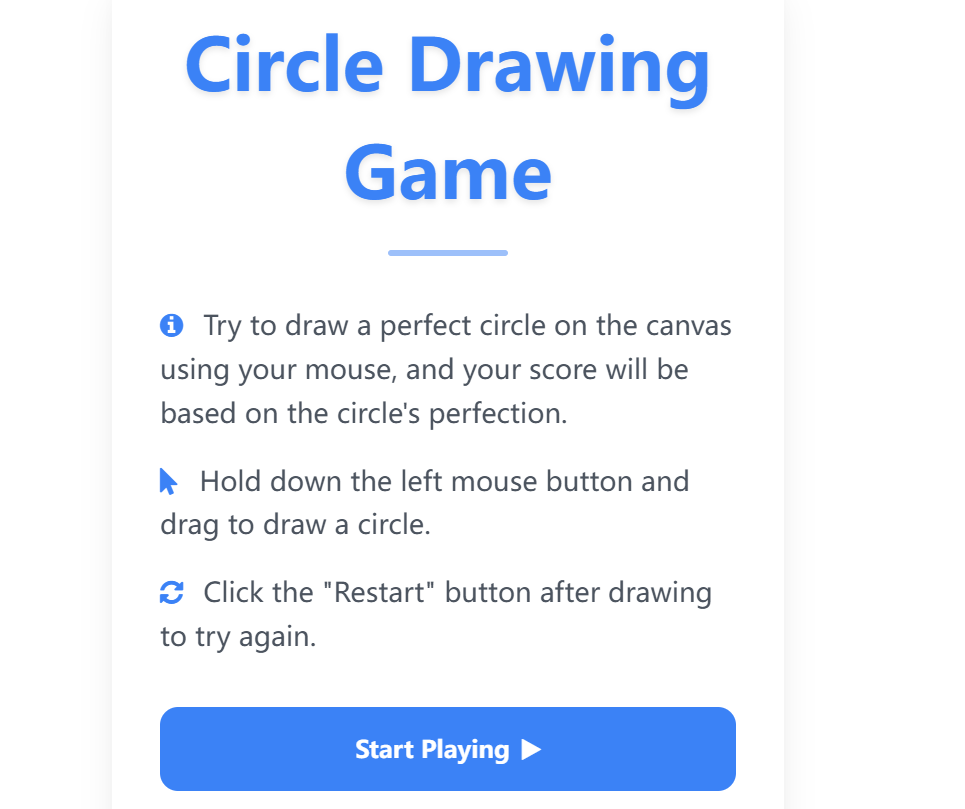
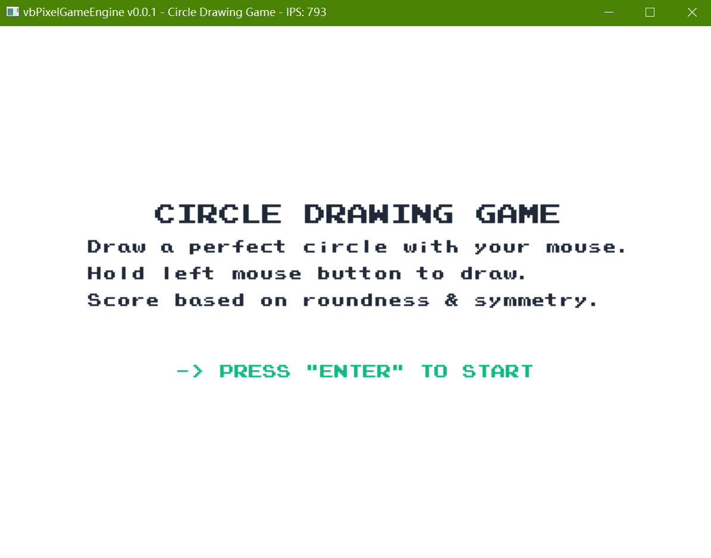

# Circle Drawing Game

**HTML Version:**


**VB.NET Version:**


## Description
This is a simple, interactive game that challenges you to draw the perfect circle using your mouse or touch. Test your precision as you're scored based on your circle's roundness and symmetry. The game features two implementations:
- An HTML5 version for modern web browsers (including mobile devices)
- A VB.NET desktop application using Dual Brain's [vbPixelGameEngine](https://github.com/DualBrain/vbPixelGameEngine)

## How to Play
```bash
git clone https://github.com/Pac-Dessert1436/Circle-Drawing-Game.git
cd Circle-Drawing-Game
```

### HTML Version
1. Open `CircleDrawing.html` directly in your web browser
2. Click the **Start Playing** button to begin
3. Draw a circle by clicking and dragging your mouse
4. Receive instant feedback on your circle's roundness and symmetry

### VB.NET Version
1. Install the [.NET 9.0 SDK](https://dotnet.microsoft.com/download/dotnet/9.0)
2. Open the project in Visual Studio
3. Build and run the application
4. Follow on-screen instructions to draw your circle

## Personal Notes
Creating this game brought to mind a quote by Luo Xiang: "I can never draw a perfect circle, but I believe there must be a perfect circle in the world."

This pursuit of an ideal - one we can approach but never fully attain - mirrors life itself. While none of us can draw a truly perfect circle, the act of trying teaches us about growth through incremental progress. Each attempt hones our precision, and small, consistent improvements eventually lead to meaningful skill development.

Yet this principle has a dual nature: just as deliberate practice builds skill, carelessness erodes it. Neglecting symmetry and proportion turns what could be a circle into something unrecognizable. It's a reminder that growth requires both dedication to improvement and vigilance against complacency.

The perfect circle may remain an ideal, but the journey toward it shapes us in ways far more valuable than the destination.

## License
This project is licensed under the MIT License. See the [LICENSE](LICENSE) file for details.